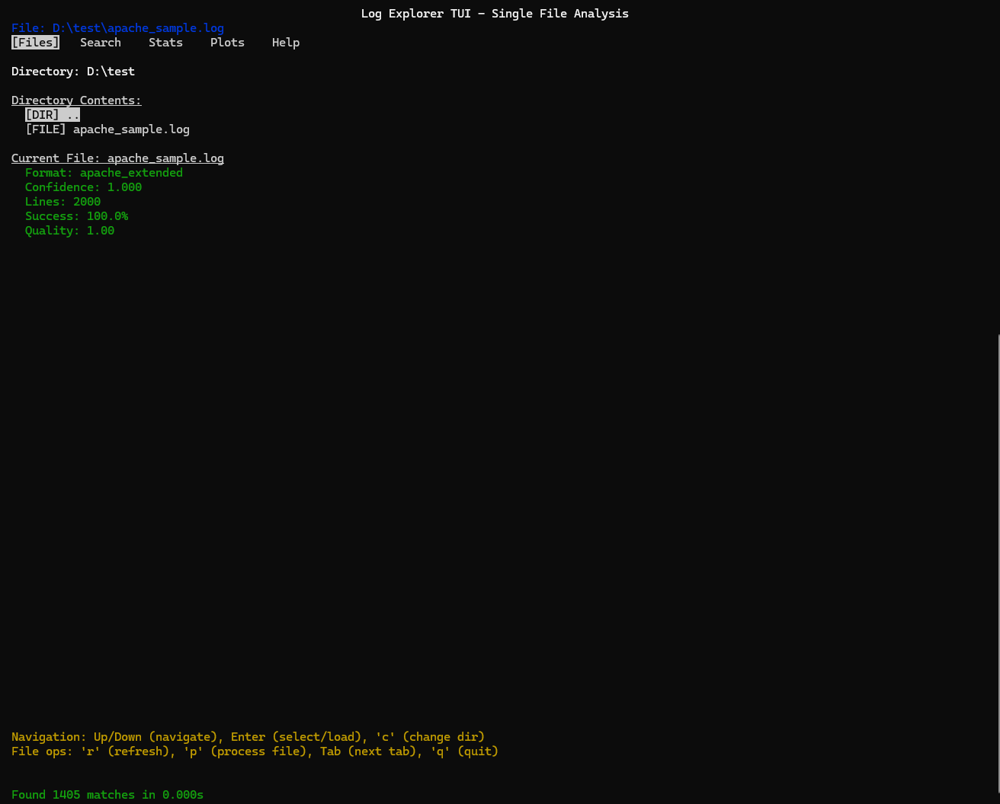

# Log Explorer TUI

**Log Explorer** is a terminal-based log analysis tool designed for clarity, flexibility, and modular extensibility.  
It supports a variety of log formats (structured and unstructured), search functionality, statistics, and visualizations — all through a powerful TUI (Text User Interface). It also handles .gz, .bz2, .xz, and .lzma files automatically — no manual decompression needed.

---

---

## Installation

### Requirements

- Python 3.7+
- `pip`

### 1. Clone the repository and install using pip

```bash
git clone https://github.com/MS-32154/py-log-analyzer

cd py-log-analyzer

pip install .
```

### 2. Launch the application

```bash
log_explorer
```

---

## Preview



---

## App Overview & Help

| **Context**       | **Key/Step**   | **Action / Description**                                                       |
| ----------------- | -------------- | ------------------------------------------------------------------------------ |
| **Workflow**      | 1              | FILES TAB: Navigate and load a log file                                        |
|                   | 2              | `p`: Process and analyze file                                                  |
|                   | 3              | SEARCH TAB: Query and filter logs                                              |
|                   | 4              | STATS TAB: View analysis metrics                                               |
|                   | 5              | PLOTS TAB: Visualize data                                                      |
| **Global**        | `Tab`          | Switch to next tab                                                             |
|                   | `q`            | Quit application                                                               |
|                   | `Page Up/Down` | Scroll content                                                                 |
| **Files Tab**     | `Up/Down`      | Navigate directory                                                             |
|                   | `Enter`        | Enter directory / Load file                                                    |
|                   | `c`            | Change directory (input mode)                                                  |
|                   | `r`            | Refresh directory listing                                                      |
|                   | `p`            | Process current file (full analysis)                                           |
| **Search Tab**    | `Shift+Tab`    | Move between form fields (Nav Mode)                                            |
| (Navigation)      | `Up/Down`      | Move between form fields                                                       |
|                   | `Enter/Type`   | Edit text fields                                                               |
|                   | `Space`        | Toggle boolean / cycle operator                                                |
|                   | `Backspace`    | Clear current field                                                            |
|                   | `Enter`        | Execute search (if not editing a field; **Highlight Operator/Case Sensitive**) |
| **Search Tab**    | Type           | Edit text (Input Mode)                                                         |
| (Input Mode)      | `Enter`        | Save and exit input mode                                                       |
|                   | `Esc`          | Cancel and exit input mode                                                     |
|                   | `Ctrl+U`       | Clear current line                                                             |
| **Search Result** | `v`            | Toggle raw lines view                                                          |
|                   | `Page Up/Down` | Scroll search results                                                          |
|                   | `F/B`          | Scroll field values table                                                      |
| **Time Format**   | Format         | `YYYY-MM-DD HH:MM:SS` (e.g., `2024-01-15 14:30:00`)                            |
| **Supported**     | Formats        | JSON, CSV, LTSV, Key-Value, Apache/Nginx logs, Syslog, Systemd Journal         |

---

## Future Improvements

- Smarter detection engine — machine learning models for log inference

- Multi-file mode in TUI — backend support exists; UI coming soon

- Export search results — backend support exists; UI coming soon

- Library interface — allow the engines to be used as an importable Python library

- TUI enhancements — better layout, filters, search UX, and tab interactions

---

## Contributing

Contributions are welcome and encouraged!
Please fork the repository and submit a pull request, or open an issue to discuss your ideas or report bugs.

---

## 📖 Background

This project was created for the Boot.dev Hackathon.
Originally, the idea was to rewrite my first project, [py-json-analyzer](https://github.com/MS-32154/py-json-analyzer), in Go — but ultimately decided to stick with Python because I'm still gaining flexibility with Go and was short on time.

So I built this tool in Python instead, focusing on log files rather than just JSON. I wrote the core engines myself, but AI helped significantly with regex pattern generation, debugging, and improving the code — especially for the TUI, which was largely AI-generated.

While regex isn't the best tool for everything, this project aims for modularity and extensibility — with plans for smarter parsing in the future.

---

## 📝 License

MIT License © [MS-32154](https://github.com/MS-32154)

---
